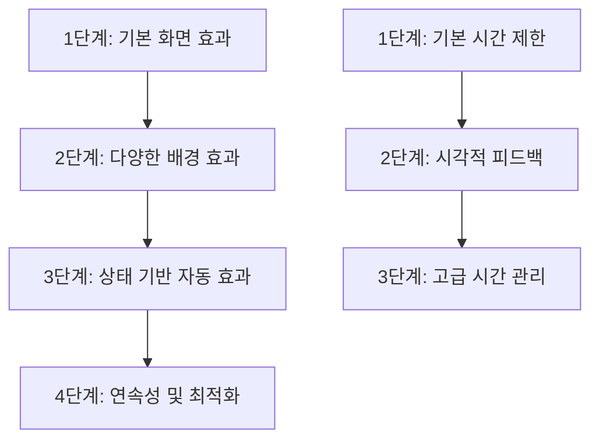

# ✅ 텍스트 로그라이크 게임 MVP 개발 체크리스트

> 이 문서는 프로젝트 개발의 진도 추적과 품질 보장을 위한 상세 체크리스트입니다. 각 단계는 **독립적으로 완성되어 테스트 가능한 기능**을 제공하며, 점진적으로 발전시켜 나가는 방식으로 구성됩니다.

**🎯 개발 철학**: 킥보드 → 자전거 → 자동차 (각 단계마다 완성된 기능)

**🎯 MVP 우선순위**: ⚡ 필수 → 🔧 중요 → ✨ 개선사항

---

## 📊 기능 의존성 관계도

**개발 순서**: 각 기능의 1단계부터 순차적으로 완성하여 점진적 발전

---

## 🎯 성능 및 품질 기준

### 📈 성능 목표
- **렌더링**: 60fps 유지 (복합 효과 적용 시에도)
- **메모리**: 변수 캐싱 50MB 이하, 배경 효과 메모리 사용량 30MB 이하
- **배터리**: 기본 텍스트 표시 대비 15% 이내 추가 소모
- **로딩**: 씬 전환 시간 500ms 이하
- **반응성**: 사용자 입력 응답 시간 100ms 이하

### 🔄 호환성 요구사항
- **씬 JSON**: 기존 씬 JSON 파일과 100% 호환 보장
- **브라우저**: Chrome 90+, Safari 14+, Firefox 88+
- **모바일**: iOS 13+, Android 8+ (API 26+)
- **디바이스**: 최소 2GB RAM에서 원활한 동작

### 📋 품질 검증 기준
- **코드 커버리지**: 핵심 로직 85% 이상
- **타입 안전성**: TypeScript strict 모드 100% 준수
- **접근성**: WCAG 2.1 AA 레벨 준수
- **사용성**: 평균 학습 시간 5분 이내

---

## 📜 1. 연속 씬 텍스트 표시 시스템

### 기능 설명

현재 씬 전환 시 텍스트가 페이드 아웃-인으로 교체되는 방식을 개선하여, 이전 씬의 텍스트를 화면에 유지하면서 새로운 텍스트를 아래에 추가하는 방식으로 변경합니다. 이를 통해 대화나 서사의 연속성을 유지하고 몰입감을 높입니다.

### 📋 단계별 구현 체크리스트

#### ⚡ 1단계: 기본 누적 텍스트 표시 (핵심 기능)
**목표**: 씬 전환 시 기존 텍스트가 유지되고 새 텍스트가 아래에 추가되는 시스템

* [x] **씬 히스토리 상태 관리** (`hooks/story/useStoryState.ts` 수정):
  * `sceneHistory: Scene[]` 상태 추가
  * 새 씬 로드 시 히스토리에 추가하는 로직
  * 현재 씬과 과거 씬 구분
* [x] **페이드 애니메이션 제거** (`hooks/story/useSceneTransition.ts` 수정):
  * contentOpacity 애니메이션 제거 또는 비활성화
  * 전환 시 즉시 새 콘텐츠 표시
* [x] **다중 StoryContent 렌더링** (`screens/StoryScreen.tsx` 수정):
  * 단일 `currentScene` 대신 `sceneHistory` 배열 렌더링
  * 각 씬에 고유 key 부여 (씬 ID + 타임스탬프)
  * 마지막 씬에만 선택지 표시
* [x] **StoryScrollView 자동 스크롤 확인**:
  * 새 텍스트 추가 시 자동으로 하단 스크롤 동작 확인
  * 필요시 스크롤 타이밍 조정
* [x] **선택지 표시 타이밍 조정**:
  * 마지막 씬의 텍스트 애니메이션 완료 후에만 선택지 표시
  * 이전 씬들은 선택지 표시하지 않음

**✅ 1단계 완료 시 달성 상태**: 씬 전환 시 이전 텍스트들이 화면에 남아있고, 새 텍스트가 아래에 추가되어 대화나 서사의 흐름을 놓치지 않고 읽을 수 있음

#### ⚡ 2단계: 콘텐츠 높이 기반 관리 (성능 최적화)
**목표**: 메모리 사용량을 관리하면서도 충분한 컨텍스트를 유지하며, 기존 씬 렌더링 로직과 완전히 호환되는 시스템

* [x] **높이 제한 설정 정의** (`constants/gameConfig.ts` 수정):
  * `SCENE_HISTORY_CONFIG` 객체 추가
  * `MAX_HEIGHT_MULTIPLIER: 1.5` (화면 높이의 1.5배까지 허용)
  * `MIN_SCENES_TO_KEEP: 2` (최소 유지할 씬 개수)
  * `HEIGHT_DEBOUNCE_MS: 300` (높이 측정 디바운스 시간)

* [x] **화면 크기 감지 Hook 생성** (`hooks/ui/useScreenDimensions.ts` 신규):
  * `useWindowDimensions()` 활용한 화면 높이 추적
  * 안전 영역(Safe Area) 고려한 실제 사용 가능 높이 계산
  * 디바이스 회전 시 높이 변경 감지

* [x] **씬 높이 캐싱 시스템** (`hooks/story/useSceneHeights.ts` 신규):
  * 각 씬의 높이를 `Map<string, number>`로 저장
  * 씬 ID와 높이 매핑 관리
  * 씬 제거 시 높이 정보도 함께 정리
  * 디바운스를 통한 과도한 업데이트 방지

* [x] **제거된 씬 관리 시스템** (`hooks/story/useRemovedScenes.ts` 신규):
  * 제거된 씬 ID를 `Set<string>`으로 관리
  * 애니메이션 상태와 실제 제거 상태 분리
  * 제거 애니메이션 완료 후 실제 상태에서 제거

* [x] **StoryHistory 컴포넌트 높이 측정** (`screens/story/components/StoryHistory.tsx`):
  * `onLayout` 프롭 추가 및 높이 측정 콜백 구현
  * 디바운스된 높이 업데이트 처리
  * 제거된 씬 필터링 로직 추가 (`removedSceneIds` 활용)

* [x] **StoryScrollView 연동** (`screens/story/components/StoryScrollView.tsx`):
  * `onHistoryHeightChange` 프롭 추가
  * 높이 정보를 상위 컴포넌트로 전달
  * 씬 제거 시 스크롤 위치 보정

* [x] **StoryScreen 통합** (`screens/StoryScreen.tsx`):
  * 높이 측정 콜백을 `StoryScrollView`와 `StoryHistory`에 전달
  * 제거된 씬 상태를 `StoryHistory`에 전달

* [x] **useStoryState 높이 기반 제거 로직** (`hooks/story/useStoryState.ts`):
  * **재렌더링 방지**: 기존 `sceneHistory` 배열은 유지하고 표시용 computed 값 분리
  * **현재 씬 보호**: 마지막 씬(현재 씬)은 절대 제거하지 않음
  * **점진적 제거**: 높이 임계값 초과 시 오래된 씬부터 하나씩 제거
  * **최소 씬 유지**: 최소 2개 씬은 항상 유지
  * **제거 우선순위**: 가장 오래된 씬 → 두 번째 오래된 씬 순으로 제거

* [x] **React.memo 최적화**:
  * `StoryContent` 컴포넌트에 적절한 memo 적용
  * props 비교 함수 구현으로 불필요한 재렌더링 방지
  * `instantDisplay` 속성 변경 시에만 재렌더링되도록 최적화

* [x] **부드러운 제거 애니메이션**:
  * 제거될 씬에 fadeOut 애니메이션 적용 (300ms)
  * CSS transition을 활용한 부드러운 높이 변화
  * 애니메이션 완료 후 실제 상태에서 제거
  * 깜빡임 및 레이아웃 점프 방지

* [x] **성능 모니터링 및 에러 처리**:
  * 높이 측정 실패 시 개수 기반 fallback (최대 20개 씬 유지)
  * 씬 제거 시 렌더링 성능 측정 로그
  * 메모리 사용량 추적 (개발 모드)
  * 예외 상황 처리 (빈 sceneHistory, 측정 불가능한 높이 등)

**✅ 2단계 완료 시 달성 상태**: 장시간 플레이해도 메모리 문제 없이 안정적으로 동작하며, 적절한 양의 이전 텍스트를 유지함. 씬 제거 시 깜빡임 없이 부드럽게 처리됨.

**🚀 성능 최적화 완료**: 
- 개별 씬 높이 측정을 제거하고 전체 컨테이너 높이만 측정하여 성능 향상
- 디바운스 로직 제거로 불필요한 재계산 방지  
- 단일 onLayout 이벤트로 측정 횟수 최소화

**🔧 일관성 개선 완료**:
- 통합 초기화 시스템으로 모든 훅의 초기화를 useStoryState에서 중앙 관리
- 실제 히스토리 제거로 메모리 효율성 개선 (제거된 씬이 실제로 메모리에서 해제됨)
- 중복 필터링 제거로 렌더링 최적화 (sceneHistory에서 이미 제거된 씬은 추가 필터링 불필요)
- 데이터 소스 단일화로 코드 복잡성 감소

**⚡ 높이 관리 최적화 완료**:
- 300ms 디바운스로 연쇄 제거 방지 (새 씬 추가 시 과도한 반응 억제)
- 스마트 제거: 높이 초과량에 비례하여 제거 개수 자동 조정 (최소 30%, 최대 50%)
- 제거 중 플래그로 중복 제거 작업 방지
- 향상된 로깅으로 성능 모니터링 개선 (초과량, 비율 등 상세 정보)
- 게임 리셋 시 디바운스 타이머와 상태 플래그 완전 정리

---

## ⏰ 3. 시간 제한 선택지 시스템

### 기능 설명

플레이어가 제한된 시간 내에 선택해야 하는 긴장감 있는 게임플레이 요소. 각 단계마다 실제 게임에서 동작하는 완성된 기능을 제공합니다.

### 📋 단계별 구현 체크리스트 (점진적 완성품 방식)

#### ⚡ 1단계: 기본 시간 제한 선택지 (완성된 기능)
**목표**: 간단한 카운트다운과 자동 선택이 동작하는 시스템

* [ ] **시간 제한 스키마 정의**:
  * 씬 JSON에 `time_limit: 10` 필드 추가 (초 단위)
  * `timeout_choice: 0` 필드로 시간 초과 시 선택할 선택지 인덱스 지정
* [ ] **기본 CountdownDisplay 구현** (`/components/CountdownDisplay.tsx`):
  * 숫자 카운트다운 표시 (10, 9, 8...)
  * 간단한 스타일링 (크기, 위치)
* [ ] **TimedChoiceManager 구현** (`/utils/scene/TimedChoiceManager.ts`):
  * 기본 타이머 기능
  * 시간 초과 시 지정된 선택지 자동 실행
* [ ] **StoryChoices 컴포넌트 연동**:
  * 시간 제한이 있는 씬 감지
  * 카운트다운 표시 및 자동 선택 처리
* [ ] **테스트 씬 작성**:
  * 10초 제한 시간 테스트 씬
  * 시간 초과 시 특정 결과로 이동하는 시나리오

**✅ 1단계 완료 시 달성 상태**: 게임에서 시간 제한이 있는 선택지가 나타나고, 시간이 지나면 자동으로 선택되는 기능이 동작함

#### ⚡ 2단계: 시각적 피드백 및 긴급감 표현 (완성된 기능)
**목표**: 시간 압박감을 시각적으로 표현하는 개선된 시스템

* [ ] **고급 CountdownDisplay 구현**:
  * 진행률 바 형태 카운트다운
  * 시간대별 색상 변화 (초록 → 노랑 → 빨강)
  * 마지막 3초 점멸 효과
* [ ] **긴급감 효과 추가**:
  * 남은 시간 30% 이하 시 화면 테두리 점멸
  * 마지막 5초 진동 효과 (모바일)
  * 긴박한 배경음 효과 (선택적)
* [ ] **애니메이션 연동**:
  * RevealTextWrapper와 연동
  * 선택지 애니메이션 완료 후 타이머 시작
  * 텍스트 표시 중에는 타이머 대기
* [ ] **다양한 시간 설정 테스트**:
  * 5초, 15초, 30초 등 다양한 제한 시간
  * 짧은 시간/긴 시간에 따른 UI 최적화

**✅ 2단계 완료 시 달성 상태**: 시간 제한 선택지에서 긴장감 있는 시각적 피드백과 함께 더욱 몰입도 높은 경험을 제공

#### 🔧 3단계: 고급 시간 관리 시스템 (완전한 시스템)
**목표**: 동적 시간 조정과 아이템 연동이 가능한 완전한 시스템

* [ ] **동적 시간 조정**:
  * 플레이어 읽기 속도 측정 및 시간 조정
  * 난이도 설정에 따른 시간 배율
  * 이전 선택 패턴 분석을 통한 개인화
* [ ] **시간 연장 아이템 시스템**:
  * 특정 아이템 사용 시 시간 연장
  * 스탯(집중력 등)에 따른 시간 보너스
  * 시간 연장 UI 및 애니메이션
* [ ] **고급 시나리오 패턴**:
  * 연속 시간 제한 선택지
  * 시간 제한 중 이벤트 발생
  * 선택지별 다른 제한 시간
* [ ] **접근성 개선**:
  * 시각 장애인을 위한 음성 카운트다운
  * 시간 제한 비활성화 옵션
  * 큰 글씨 모드에서의 UI 최적화

**✅ 3단계 완료 시 달성 상태**: 플레이어의 능력과 게임 상황에 맞춰 동적으로 조정되는 완전한 시간 제한 시스템이 완성됨

#### ✨ 테스트 및 문서화
* [ ] **사용성 테스트**:
  * 다양한 연령대 사용자 테스트
  * 시간 압박감 vs 재미 균형 측정
  * 접근성 테스트
* [ ] **성능 테스트**:
  * 타이머 정확성 측정 (±50ms 이내)
  * 배경 효과와 동시 실행 시 성능 확인
* [ ] **문서화**:
  * SCENARIO-GUIDE.md 업데이트
  * 게임 밸런스 가이드라인
  * 상황별 템플릿 제공

---